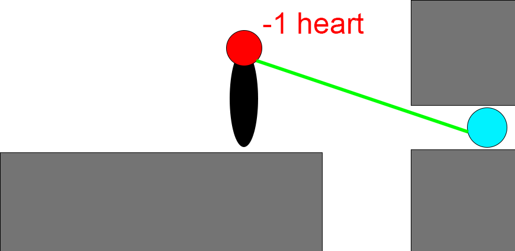
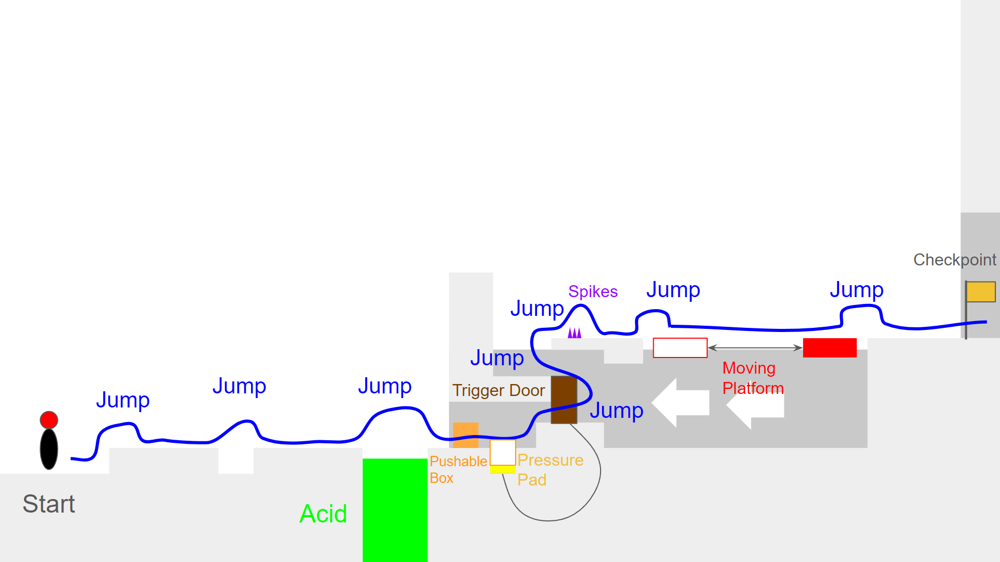

# COMP2150  - Level Design Document
### Name: Ryan Ly
### Student number: 47615540 

## 1. Player Experience (~700 words)

### 1.1. Discovery
When the player starts the level assuming that the player knows the controls, there are mechanics that will be introduced to the player. This will show the player on what to expect when it comes to trying to find out how to overcome obsticles no matter the difficulty and learning how the mechanics works when being interacted by the player. 

For example, when the player observe the first mechanic in the level (acid), they will find out how the mechanic work. However, after discovering the first mechanic, they will discover a new different mechanic. This also applies with other different mechanics that were introduced to the level.

This will indicate to players that once the players learn about a certain mechanic, the players will become more familiar when they meet with the same mechanic again.

### 1.2. Drama
At the beginning of the level, the level introduce to the players each of the seperate mechanics. However when the player make very good progress throughout the level, there will be combined mechanics that can make the difficulty intense because after the player mastered each individual mechanics, the player will find out the combined mechanics in the level.

For example, after the player finished and become fimilarised with the mechanics, they will discover that there will be mulitple mechanics happening at once like having the spitter inside the wall to act as a bodyguard of the other mechanics. This will put the player into a situation where the player has to find another way to overcome a combined mechanic.

This demonstrates that the player will be given once choice to the level which is to make the player complete the level in a fast pace otherwise the player will be killed if failed to do so.

### 1.3. Challenge
The main challenge is the difficulty and trying to avoid obstacles. When there are challenges in the level, there can be more mechanics and more enemies combined. The challenge not only applies to the amount of mechanics and enemies, it also applies to the complexity of the level design.

For example when the player stumbled upon the third section of the level, there are mainly spitters surrounding the player and other mechanics.

This reveal players that having spitter surround the player will make the player keep moving as spitters will always attempt to stop the player from beating the level.

### 1.4. Exploration
How does your level design facilitate autonomy and invite the player to explore? How do your aesthetic and layout choices create distinct and memorable spaces and/or places?

At the beggining of the level, the player explore areas that the players want to find. Players can explore area that they have not been before. Exploring the level can also help the player to find out the ending of the level or certain area that can give them an advantage. When players explored the area before, certain case they might have to go back to a certain area to see if the player missed something or not otherwise the player will get lost very easily. 

For example, when the player nearly reaches to the end of the level, there is another area that the player could explore like when the player explore the area they will get something like a health pickup.

This indicates that when the player exploered an optional area, they will become more prepared and more ready for another challenge that the player will face.

Another example that the player can explore is in the second section of the level. When the player explored that area, there are multiple paths and the areas that the player exploeres will not get lost.

This demonstrates that the player can get an oportunity to reexplore an area that they have been before but will find out that another path has been opened.

## 2. Core Gameplay (~400 words)

### 2.1. Acid

1)

2)

Adding the acid in the beginning of the level can be a good obstacle as it introduces the player to a hazard of the level.

### 2.2. Pushable Boxes

1)

2)

Adding Pushable Boxes as there can be other mechanics that may require a Box to push with

### 2.3. Pressure Pads

1)

2)

Pressure Pads will make the player discover a mechanic that will trigger another mechanic.

### 2.4. Trigger Doors

1)

2)

Trigger doors will prevent the player from exploring the level even furthur as it need to be activated by a certain mechanic.

### 2.5. Spikes

1)

2)

Adding spikes also introduce another hazard of the level because this keeps the player aware that acid is not the only mechanics that harms the player.

### 2.6. Moving Platforms

1)

2)

3)

4)

Moving platform will safely help the player getting to one side to another instead of jumping to the big gap.

### 2.7. Checkpoint

1)

2)

Checkpoints prevents players from repeating a large section of the level. If the players dies on acid, the player respawn at the checkpoint instead.

### 2.8. Weapon Pickup (Staff)
1)

2)

Staff was added to the game because there will be enemies or other mechanics that requires a staff to hit with.

### 2.9. Chompers

1)

2)

Makes the player aware that the enemy will be after the player.

### 2.10. Destructable Columns

1)

2)

The level assumes that the player has picked up the staff. Without the staff, the player can not destory a destructable column with prevents the player from exploring the level even furthur.

### 2.11. Weapon Pickup (Gun)

Gun plays a role of killing enimes at the long range and activates a single use switch.

### 2.12. Single Use Switches

1)

2)

The level assumes that the player has picked up the gun. The single use switches can only be activated when the bullet interacts with the switches.

### 2.13. Spitters

Adding the spitter to the level creates another obsticle to the player. This makes the player trying to avoid the spit or passing through the spitter before the spitter spits.

1)

2)

### 2.14. Destructable Walls

1)

2)

Adding destructable wall will not only make the player defended from other enemies but also gives player time to rest before continuing the level. The player requires hit the destructable wall using the staff five times before continuing.

### 2.15. Health Pickups

1)

2)

After the player took some damages from the enimies or obstacles, health pickup will be provided because this will prevent the player from dying which can result in going to the beginning of the level once the player is out of heats. This also makes the player prepare for the upcoming complex section and also helps when the players health is critically low.

### 2.16. Pass Through Platforms

1)

2)

Pass through platforms plays an important role as it prevents the player from going at the wrong direction of the level. 

### 2.17. Bridge

1)

2)

The bridge will block the players path unless it was triggered by either a pressure pad or a single use switch.

### 2.18. Keys

1)

2)

The keys plays an important role as three keys are the requirement for the player to sucessfully complete the level by oepning the door at the end of the level

### 2.19. (Destructable walls and spitter)

When there is a spitter and destructable wall, it slows down the player from destructing the wall because not only the player has to destruct the wall to continue the level, the player also needs to avoid the spitters' spit.

### 2.20. (Moving platform and acid)

IF the player fails to make a jump on the moving platform, the player will fall into acid which results in the player having to go back to the checkpoint otherwise to the beginning of the level if failed to land a jump son the platform.

### 2.21. (Moving platform and spikes)

Adding a spike hanging upside with a moving platform will make the player crouch

## 3. Spatiotemporal Design

### 3.1. Molecule Diagram

### 3.2. Level Map – Section 1

### 3.3.	Level Map – Section 2

### 3.4.	Level Map – Section 3

## 4. Iterative Design (~400 words)
Making a iterative design really comes to play when trying to make the layout of the game. Making a prototype from a storyboard really helps when trying to find if the player can sucessfully make it from one jump to another and adding a mechanics to see if the work against the player. Playtesting of level also helps when testing multiple mechanics in a single encounter, making the sure that the mechanics are working as intended to be, making sure that the triggers in the level is working correctly, make sure that the player can beat the level within the time given, make sure that every section of the level can be playale and making sure that the level is not annoying for the player to beat.

When making the level from Unity, it needs to make sure that the player tries to understand the mechanics of the game and needs to ensure that each section of the level will have a good intensity curve. Without the players understanding the mechanics for the level and starting the level with a difficulty being too hard for the player, it will make the level not being inviting to the player.

When playtesting the level, there are some mechanics that need to be added or removed from the scene becuase some mechanics do not work in certain areas of the level or sometimes some combined mechanics may take too long for the player to beat, there is also needs to be a lot of playtesting with the level becuase when finishing the level, the amount of time taken will always display a different result.

When playtesting the level and timing how long it takes to beat the level, there is one sence that did not make it to the Unity level from the storyboard becuase it may take longer for the other players to beat the level in a certain timeframe.

However, there are improvements for the level to be better, when playing the level, there are a lot of destrutable walls which can result in additional time to take to beat the level within the time frame and making sure that certain areas of the game is not confussing for the players to discover and explore.

## Generative AI Use Acknowledgement

### Tool Used: Grammarly
**Nature of Use** To fix up the errors of the spelling

**Evidence Attached?** Example Text

**Additional Notes:** I used Grammarly to fix up the wordings

